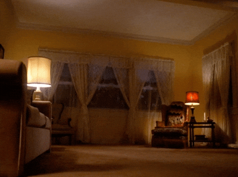

**Visual Art · Portfolio**

[↗ Visit the website](https://ginisia.github.io/portfolio_arty/)

---

Personal artistic portfolio, gathering photographic series and visual experiments.

The website is currently in development.

### Selected series

- **Emkov**
- **Hide Your Fires**
- **Lightmare**
- **Ást**

---

## Tech

- HTML
- CSS
- JavaScript

No framework, no build system — just a small static site.

---

## Features

- Responsive layout
- Randomized image order and formats
- Interactive portfolio filters
- Lightbox
- Lazy-loaded images
- Scattered / experimental layout for **Ást**
- Mobile and tablet adaptations

---

## Responsive

Yes.

The layout adapts across desktop, tablet and mobile.

---

`made with images, code & strange little things`

